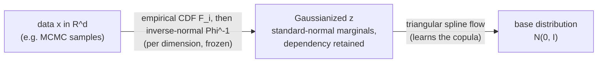

<p align="center">
  
</p>

<h1 align="center">coppuccino</h1>

<p align="center">
  <em>Density estimation for multivariate data with copula normalizing flows, in JAX.</em>
</p>

<p align="center">
  <a href="https://github.com/AaronDJohnson/coppuccino/actions/workflows/test.yml"></a>
  
  
</p>

---

**coppuccino** fits and samples from complex multivariate probability
distributions by combining two classical ideas: *copulas*, which separate a
joint distribution into its one-dimensional marginals and a dependency
structure, and *normalizing flows*, which learn that dependency structure
flexibly. It is designed for — though not limited to — density estimation on
**MCMC posterior samples**, where it enables fast resampling, density
evaluation, importance weighting, and calibration diagnostics.

## The idea

Any continuous joint distribution can be decomposed into its marginals and a
*copula* that couples them. This is **Sklar's theorem**: for a joint density
$p(\mathbf{x})$ on $\mathbb{R}^d$ with marginal CDFs $F_i$ and marginal
densities $p_i$,

$$
p(\mathbf{x}) \;=\; \underbrace{c\big(F_1(x_1), \dots, F_d(x_d)\big)}_{\text{copula density}} \;\; \prod_{i=1}^{d} \underbrace{p_i(x_i)}_{\text{marginals}} .
$$

The copula density $c$ captures *all* of the dependence between dimensions; the
$p_i$ capture the shape of each dimension on its own. Estimating these two
pieces separately is often much easier than estimating $p(\mathbf{x})$
directly — especially when the marginals are sharp, bounded, skewed, or
multimodal, which tends to defeat a plain normalizing flow.

coppuccino estimates the marginals **nonparametrically** and the copula with a
**normalizing flow**.

## How it works

Fitting proceeds in two stages.



**1. Empirical marginal transforms (Gaussianization).** Each dimension is
mapped to a standard normal through the probability integral transform followed
by the inverse-normal CDF,

$$
z_i \;=\; \Phi^{-1}\!\big(F_i(x_i)\big), \qquad i = 1, \dots, d,
$$

where $\Phi$ is the standard normal CDF and each $F_i$ is an empirical CDF built
from the data quantiles as a **monotone spline** (a rational-quadratic spline by
default; see [Marginal transforms](#marginal-transforms)). After this step the
transformed variable $\mathbf{z}$ has exactly standard-normal marginals while
retaining the full dependency structure — so the copula is all that remains to
be modeled. These transforms are estimated once and then frozen.

**2. The copula flow.** A [triangular spline flow](https://github.com/danielward27/flowjax)
$T$ models the joint density of $\mathbf{z}$ against a standard-normal base
$\boldsymbol{\varepsilon} \sim \mathcal{N}(\mathbf{0}, \mathbf{I})$. If the
dependence were exactly Gaussian, $T$ would only need to learn a correlation —
the classical Gaussian copula; the flow generalizes this to arbitrary
dependence. Only this stage is trained.

Putting the stages together, the log-density of a point is available in closed
form via the change-of-variables formula,

$$
\log p(\mathbf{x}) \;=\; \log p_Z(\mathbf{z}) \;+\; \sum_{i=1}^{d}\Big( \log p_i(x_i) - \log \phi(z_i) \Big),
$$

where $\log p_Z$ is supplied by the flow, $\phi$ is the standard normal density,
and the sum is the log-Jacobian of the marginal Gaussianization. **Sampling**
runs the pipeline in reverse: draw $\boldsymbol\varepsilon$ from the base,
push it through the flow to obtain $\mathbf{z}$, then invert the marginal
transforms with $x_i = F_i^{-1}\!\big(\Phi(z_i)\big)$.

### Why this design

- **Separation of concerns.** The flow spends all of its capacity on
  dependency, because the marginals are already standardized. The empirical
  CDFs, in turn, reproduce difficult marginal shapes (bounded, spiky,
  heavy-tailed, multimodal) that flows struggle to fit on their own.
- **Honest density and importance weights.** With the default
  rational-quadratic marginals, the forward transform, its inverse, and its
  derivative all come from a *single* parameterization and are mutually exact to
  machine precision, so `sample_and_log_prob` returns self-consistent
  densities.
- **Built for bounded posteriors.** By default the marginals clip to the
  observed data range; `prior_bounds` extends them cleanly to a known prior
  support, which is the common situation for MCMC chains.

## Installation

```bash
pip install coppuccino
```

From source:

```bash
git clone https://github.com/AaronDJohnson/coppuccino.git
cd coppuccino
pip install .
```

### Development

This project is managed with [uv](https://docs.astral.sh/uv/):

```bash
uv sync           # create the environment and install coppuccino + dev deps
uv run pytest     # run the test suite
```

## Quick start

```python
import numpy as np
from coppuccino import normalizing_flows_fit, sample, log_prob, save_flow, load_flow

# Fit a copula flow to multivariate data (e.g. MCMC posterior samples)
data = np.random.randn(5000, 3)
flow = normalizing_flows_fit(data, max_epochs=200)

# Draw new samples from the fitted distribution
new_samples = sample(flow, n_samples=1000, rng_seed=42)

# Evaluate the log probability density
log_probs = log_prob(flow, new_samples)

# Persist and reload the model
save_flow(flow, "my_flow.pkl")
loaded_flow = load_flow("my_flow.pkl")
```

The [`examples/`](examples/) directory contains a worked, end-to-end notebook —
[`galactic_binary_example.ipynb`](examples/galactic_binary_example.ipynb) — that
fits a flow to a real gravitational-wave posterior and compares the samples to
the original chain, plus an HDR calibration walkthrough in
[`hdr_credibility.ipynb`](examples/hdr_credibility.ipynb).

## API

| Function | Purpose |
| --- | --- |
| `normalizing_flows_fit(chain, ...)` | Fit a copula flow to data; returns the fitted model. |
| `sample(flow, n_samples, rng_seed=...)` | Draw samples from a fitted flow. |
| `log_prob(flow, samples)` | Evaluate the log density at given points. |
| `sample_and_log_prob(flow, n_samples, ...)` | Draw samples and their log densities together (for importance sampling). |
| `save_flow(flow, path)` / `load_flow(path)` | Serialize / deserialize a fitted flow. |
| `compute_injection_hdr(samples, injection_params, ...)` | HDR credibility of injected/true parameters (calibration). |
| `check_in_support(samples, injection_params)` | Whether a point lies within the sample support. |

Key options to `normalizing_flows_fit` include `flow_layers` and `knots` (flow
capacity), `max_epochs`, `learning_rate`, `patience` (training), `prior_bounds`,
`tail_model`, and `marginal` (the marginal model, below). See the docstrings for
the full list.

### HDR credibility (inference validation)

The highest-density-region (HDR) credibility of a known/injected parameter is
the fraction of the fitted distribution that is *more probable* than that point
— equivalently, the smallest HDR credible level whose region contains it. A
point at the mode scores near 0; a point far in the tails scores near 1. For
well-calibrated Bayesian inference these values are uniform on $[0, 1]$ across
many events — a standard probability–probability check.

```python
from coppuccino import compute_injection_hdr

posterior_samples = ...          # shape (n_samples, n_params)
true_params = np.array([1.0, 2.0, 3.0])

hdr = compute_injection_hdr(posterior_samples, true_params)
# `hdr` is an array: hdr[0] for a single injection, or one value per row for a
# 2D batch of injections. Injections outside the sample support return 1.0.
```

## Marginal transforms

The empirical marginals are the heart of the method, and a few options control
how they behave at and beyond the edges of the data.

### Interpolant

```python
flow = normalizing_flows_fit(data)                   # marginal="rqs" (default)
flow = normalizing_flows_fit(data, marginal="pchip") # original PCHIP interpolant
```

Both families use the same empirical-quantile knots and the same tail and
prior-bound handling, so they produce nearly identical fits. `"rqs"` (a monotone
rational-quadratic spline) is preferred because its forward map, inverse, and
derivative share a single parameterization and are mutually exact to machine
precision, which keeps `sample_and_log_prob` weights honest. The `"pchip"` path
builds the CDF and its inverse as two independent splines that are only
approximate inverses of each other; it is retained for reproducing older fits.

### Prior bounds (recommended for MCMC chains)

```python
# Extend the empirical CDF out to a known prior support
bounds = np.array([[-10, 10], [-5, 5], [0, 100]])
flow = normalizing_flows_fit(data, prior_bounds=bounds)
```

By default the marginals clip to the observed data range. Supplying
`prior_bounds` extends each marginal CDF to the prior edges, so the flow can
generate samples across the full prior support rather than being capped at the
most extreme training sample.

### Heavy-tailed marginals (experimental)

```python
# EXPERIMENTAL: peaks-over-threshold Generalized Pareto tails
flow = normalizing_flows_fit(data, tail_model="gpd", tail_quantile=0.05)
```

For heavy-tailed marginals, `tail_model="gpd"` fits a Generalized Pareto
Distribution to each tail via peaks-over-threshold, modeling the extremes more
faithfully than the default Gaussian tail. `tail_quantile` sets the fraction of
samples in each tail (default 0.05). This feature is **experimental** — its API
may change — and it ignores `tail_extension` and `prior_bounds`.

## Requirements

- Python 3.11–3.14
- JAX / jaxlib >=0.4.38,<0.8
- NumPy >=1.26,<3
- SciPy >=1.10 (>=1.11.3 on Python 3.12, the oldest with cp312 wheels)
- Equinox >=0.13.2,<0.14
- jaxtyping >=0.3.6,<0.4
- interpax >=0.3.11,<0.4
- FlowJAX >=17.2.1,<18
- paramax >=0.0.3
- cloudpickle >=2.2.1,<4 (used by `save_flow` / `load_flow`)

Python **3.11 through 3.14** are supported and tested. The lower bounds are the
oldest versions that pass the test suite on 3.11/3.12; on 3.13 and 3.14 a normal
install resolves newer versions (the oldest floors predate cp313/cp314 wheels),
which is what the CI "highest" jobs exercise there. The JAX upper bound is set by
the flowjax 17.2.1 pairing, not by choice — jax 0.7.x is the newest series that
runs cleanly with it while still shipping cp314 wheels. The exact ranges
(including per-Python markers) live in `pyproject.toml` and `pip`/`uv` resolve
them automatically. The example notebooks need a few extra packages — see
[`examples/requirements.txt`](examples/requirements.txt).

## Citation

If you use coppuccino in your research, please cite it:

```bibtex
@software{coppuccino,
  author  = {Johnson, Aaron D.},
  title   = {coppuccino: copula normalizing flows in JAX},
  year    = {2026},
  version = {1.0.0},
  url     = {https://github.com/AaronDJohnson/coppuccino}
}
```

## References

- A. Sklar (1959). *Fonctions de répartition à n dimensions et leurs marges.*
  Publications de l'Institut de Statistique de l'Université de Paris. — Sklar's
  theorem.
- C. Durkan, A. Bekasov, I. Murray, G. Papamakarios (2019).
  *[Neural Spline Flows](https://arxiv.org/abs/1906.04032).* NeurIPS. — The
  rational-quadratic spline transforms used here.
- G. Papamakarios, E. Nalisnick, D. J. Rezende, S. Mohamed, B. Lakshminarayanan
  (2021). *[Normalizing Flows for Probabilistic Modeling and Inference](https://arxiv.org/abs/1912.02762).*
  JMLR. — Review of normalizing flows.
- The flow implementation builds on
  [FlowJAX](https://github.com/danielward27/flowjax).

## License

[MIT](LICENSE) © Aaron D. Johnson
